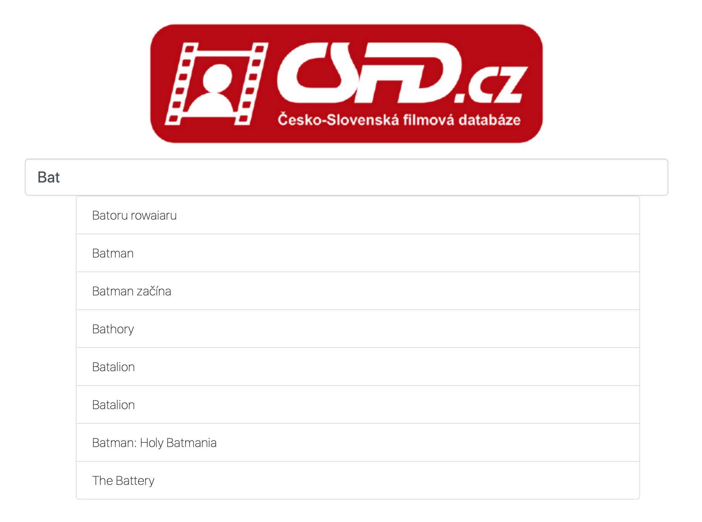
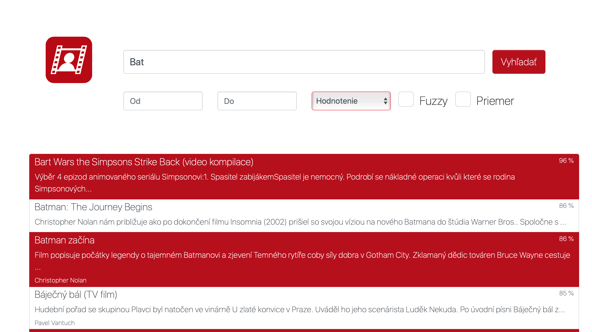

# Searcher for CSFD.cz

CSDF movie searcher is a web application for searching movies in [Czech-Slovak film database](https://www.csfd.cz).
We use Elasticsearch for storing and indexing data. 
For the purpose of the application we designed our own mapping and analyzers to get better performance.

## Screens

### Home screen 

The home screen provides an input field for searching with autocomplete function.
The application uses its own analyzer for autocomplete function. 
Each time a letter of alphabet is typed searcher makes a new query on elasticsearch.
The application displays first 8 results from a query response sorted according to the score function.

Home screen | Autocomplete
:---:|:---:
 | 

### Searched results 

On "searched results" screen you can find advanced searching functions and of course searched results.
In the dropbox menu you can choose searching by:
- Movie title
- The name of the actor

or you can add the movie rating range.

If you do not know the exact name of the movie or the actor you can use fuzzy search by checking checkbox "Fuzzy".
Last but not least the application provides function to show only movies with rating better than the average rating of searched movies.

After you click on the movie you will be redirected to the description of the movie in CSFD.

 
 
## Built With

* [Django](https://docs.djangoproject.com/en/2.1/) - Web framework
* [Bootstrap](https://getbootstrap.com/docs/3.3/getting-started/) - CSS Framework
* [Elasticsearch](https://www.elastic.co/guide/en/elasticsearch/reference/6.4/index.html) - Search engine 
* [BeautifulSoup](https://www.crummy.com/software/BeautifulSoup/) - Python package for parsing HTML and XML documents

The application was created as a school project for subject Information Retrieval.
Data from the CSFD was downloaded according to Ethical Web Scraping.